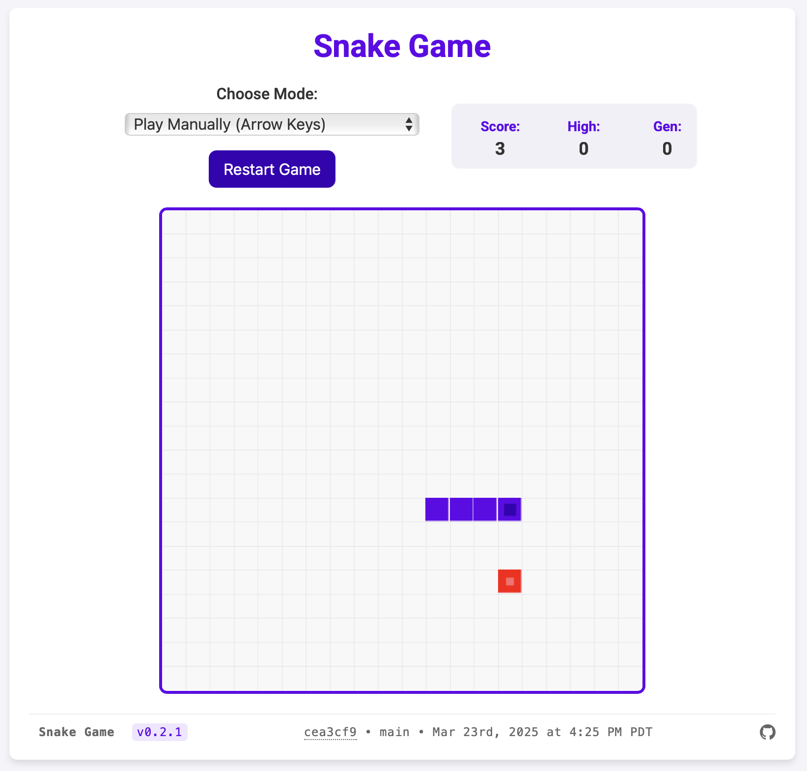

# 🎯 AI Snake Game with Docker & TensorFlow.js

## Overview

This project demonstrates an AI-powered Snake game with TensorFlow.js. Game allowing users to either play manually or let the AI control the snake.

## Live Demo

**[Play the game now on Vercel!](https://snake-game-tensorflow-docker.vercel.app)**

Try out the AI-powered Snake game without any installation. The live demo is deployed on Vercel and includes all features of the local version.




## Project Structure

- **index.html** - Main webpage hosting the game interface & loads library
- **ai.js** - AI model integration and decision-making
- **script.js** - Game logic and user interactions
- **style.css** - Theme and color settings
- **Dockerfile** - File to build the container image

## Setup Instructions

### Using Docker Compose (Recommended)

This project uses Docker Compose for easy container management. The `docker-compose.yml` file defines two services:

- `snake-game`: Production service running on port 8080
- `snake-game-dev`: Development service with live code reloading on port 8081

```sh
# Start the production service
docker compose up -d

# Start the development service with live code reloading
docker compose --profile dev up -d snake-game-dev

# View logs
docker compose logs -f

# Stop all services
docker compose down

# Clean up images and containers
docker compose down --rmi local
```

### Using npm Scripts

This project includes several npm scripts to make working with Docker Compose easier:

```sh
# Build and start the application in one command
npm start

# Build the Docker images
npm run docker:build

# Start the production service
npm run docker:up

# Stop all services
npm run docker:down

# Restart services
npm run docker:restart

# View logs
npm run docker:logs

# Start the development service with live code reloading
npm run docker:dev:up

# Stop the development service
npm run docker:dev:down

# Clean up images and containers
npm run docker:clean
```

### Accessing the Application

Open your web browser and access the appropriate URL:

```sh
# Production service
http://localhost:8080

# Development service (with live code reloading)
http://localhost:8081
```

## Version Footer

The application includes a version footer that displays important information about the current build:

- **Application Name and Version**: Shows the application name and version from package.json
- **Commit Information**: Displays the latest commit hash (clickable, links to GitHub), branch name, and commit date
- **GitHub Repository**: Includes a link to the project's GitHub repository

This information is automatically updated during the build process through the following components:

- `generate-commit-info.js`: A Node.js script that extracts the latest commit information and generates JSON data
- `version-info.js`: A JavaScript module that fetches and displays the version information in the footer

The version footer is particularly useful for:

- Identifying which version of the application is currently running
- Tracking the exact commit that was deployed
- Quickly accessing the GitHub repository for more information

## Deploying to Vercel

This application is deployed to Vercel at [https://snake-game-tensorflow-docker.vercel.app](https://snake-game-tensorflow-docker.vercel.app). The project includes Vercel-specific configuration to ensure the version footer works correctly in the Vercel environment.

### One-Click Deployment

You can deploy this application to Vercel with one click:

[](https://vercel.com/new/clone?repository-url=https%3A%2F%2Fgithub.com%2FTheRobBrennan%2Fsnake-game-tensorflow-docker)

### Manual Deployment

To deploy manually:

1. Fork or clone this repository
2. Install the Vercel CLI: `npm install -g vercel`
3. Login to Vercel: `vercel login`
4. Run the deploy script: `npm run deploy`

The deploy script will:

1. Generate the commit info for the version footer
2. Build the project into the `dist` directory
3. Deploy the application to Vercel

### Project Structure for Vercel

The project uses the following configuration for Vercel deployment:

- `dist/`: Build output directory (generated during build, kept in .gitignore)
- `public/`: Static assets that don't need processing
  - `assets/`: Images and other media files
- `vercel.json`: Vercel-specific configuration with:
  - `buildCommand: null` - Prevents Vercel from running a build command (we build locally)
  - `outputDirectory: "dist"` - Tells Vercel to serve files from the dist directory

## Testing GitHub Actions Locally

We recommend using [act](https://github.com/nektos/act) to test GitHub Actions workflows locally before pushing changes if you are developing on a Mac.

The application does not have to be running in Docker to test the workflows, but Docker Desktop must be running for the act tests to run and spin up the necessary containers.

Prerequisites for macOS

- Homebrew
- Docker Desktop (must be running)

```sh
# Install act using Homebrew
brew install act

# Verify installation
act --version # Should show 0.2.74 or higher

```

### Running Tests

The following test scripts are available:

1. `npm run test`
   - Primary test command
   - Runs all workflow tests via test:workflows
   - Recommended for general testing

2. `npm run test:workflows`
   - Runs all workflow tests in sequence
   - Tests PR title validation and version bumping
   - Provides detailed feedback

3. `npm run test:workflows:semantic`
   - Tests PR title validation only (using minor version example)
   - Validates against conventional commit format

4. `npm run test:workflows:semantic:major`
   - Tests PR title validation with breaking change
   - Validates major version bump detection

5. `npm run test:workflows:semantic:minor`
   - Tests PR title validation with new feature
   - Validates minor version bump detection

6. `npm run test:workflows:semantic:patch`
   - Tests PR title validation with bug fix
   - Validates patch version bump detection

7. `npm run test:workflows:semantic:invalid`
   - Tests PR title validation with invalid format
   - Verifies rejection of non-compliant PR titles

8. `npm run test:workflows:version`
   - Tests version bump workflow
   - Note: Git operations will fail locally (expected)

9. `npm run test:workflows:merge`
   - Tests main branch merge workflow
   - Simulates PR merge and version bump process
   - Note: Git operations will fail locally (expected)

#### Expected Test Results

1. Semantic PR Check Tests:
   - All tests should pass except "invalid" test
   - Invalid PR format test should fail with clear error

2. Version Bump Tests:
   - Will show git authentication errors (expected)
   - These workflows can only be fully tested in GitHub Actions

3. Merge Tests:
   - Will show authentication errors locally (expected)
   - Tests workflow syntax and merge logic
   - Full functionality requires GitHub Actions environment

## Development Guidelines

- **Version Control**: We use semantic versioning with automated version bumps
- **Commit Signing**: All commits must be GPG signed
- **Pull Requests**: PR titles must follow conventional commit format

For detailed guidelines, see:

- [Contributing Guidelines](./CONTRIBUTING.md)
- [Testing Documentation](./.github/docs/TESTING.md)
- [Repository Setup](./.github/docs/SETUP.md) (for maintainers)

## License

This project is licensed under the [Apache 2.0 License](/LICENSE).
